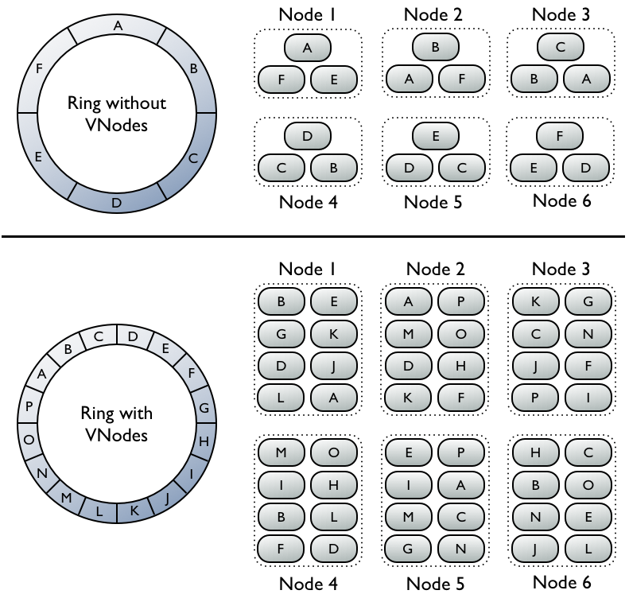
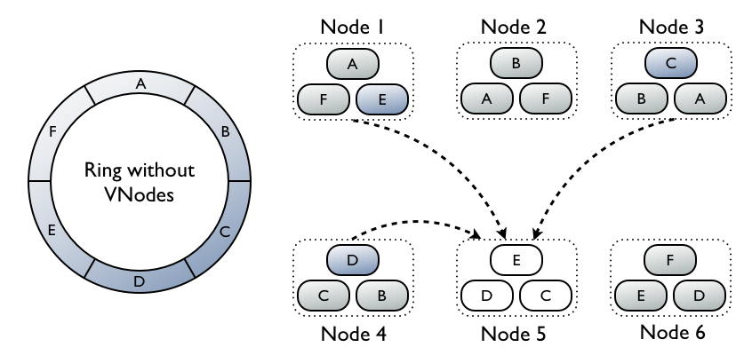
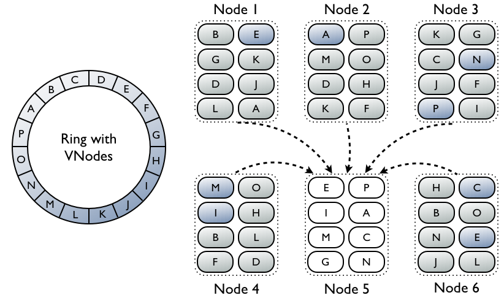
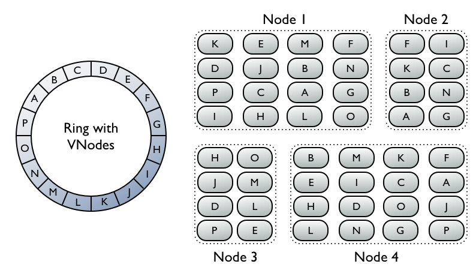

# Cassandra distributed architecture


## Keywords

* __Gossip__

    * 是一種點對點溝通的 protocol, 用來發現其它 cassandra 的位置 && 狀態, gossip 的訊息也會存在 local disk 中, 方便重啟時快速溝通

* __Node__
    * Basic infracture component of cassandra. where  you store your data

* __datacenter__
    * Node 的集合. 可以是其一
        * physical datacenter (物理距離上接近, 屬於相同 datacenter)
        * virtual datacenter(物理上接近, 但是屬於不同 datacenter).
    * 需要注意的是 datacenter 不可以跨物理位置, 比如亞洲跟歐洲不能屬於同個 datacenter

* __cluster__
    * datacenter 的集合, 可以跨物理距離

* __Partitioner__
    * partitioner 是一個 hash function 用來決定 replica 數據的位置.


## Keys in cassandra

* PRIMARY KEY
* PARTITION KEY
* CLUSTERING KEY
* COMPOSITE KEY
* COMPOUND KEY

### Explain

#### Primary Key
$$primary = partition key + [clustering key]$$

* primary key is unique
* clustering key is optional
* primary key can be compound primary key, use two or more columns as the primary key.

#### Partition Key

```sql
# Single primary key
# primary key = partition key
create table tablea (
    key text PRIMARY KEY,
    data text
);
#  Composite primary key
#  key_part_one -> partition key
#  key_part_two -> clustering key
#  PRIMARY KEY(key_part_one, key_part_two) -> Compound primary key
create table tablea (
    key_part_one text,
    key_part_two int,
    data text
    PRIMARY KEY(key_part_one, key_part_one)
);
-- Multiple Partition Keys and Multiple Clustering Keys
# Both partition && clustering key can be composite
create table stackoverflow (
    k_part_one text,
    k_part_two int,
    k_clust_one text,
    k_clust_two int,
    k_clust_three uuid,
    data text,
    PRIMARY KEY((k_part_one,k_part_two), k_clust_one, k_clust_two, k_clust_three)      
);
```

## Partitioner

Partitioner 負責決定數據(include replicas) 被分派到那一個 Node,
Partitioner 會基於 partition key 產生 token, 透過 token value 決定那一個 node 負責該筆數據

### Partitioners

* __Murmur3Partitioner__ (default)
    * 透過 MurmurHash hash 均勻分散數據
* __RandomPartitioner__
    * 透過 MD5 hash 均勻分散數據
* __ByteOrderedPartitioner__
    * 排序 key bytes 做數據分散

### Examples

透過 __Murmur3Partitioner__ 產生六個 nodes 的 tokens

```python
python -c "print([str(((2**64 / 6) * i) - 2**63) for i in range(6)])"
```

> 當 virtual node 沒開啟時, 需要把 token 設在 cassandra 設定檔(cassandra.yaml) 中的 `initial_token`


## Virtual nodes

__virtual nodes 可以將資料以更細的顆粒度分散在系統中__

* Tokens 會自動產生然後分配給各個 node
* 當有 node 新增or刪除, Rebalancing cluster 會自動完成




### Rebuilding dead node 會更快

當需要 rebuild dead node, cassandra 的重啟步驟

1. 壓縮驗證, 迭代所有數據生成 Merkle tree. 這部份會花費比較多時間
2. streaming 所需的資料. 這部份花費時間比較短

所以使用 vnode 有兩個好處:

1. 平行化驗證, 分散在更多 node 上
2. streaming 傳輸會更快




### Heterogeneous machines

可以調整每一臺 Node 分配到的 vnode 比例, 不需要使用同規格的機器



