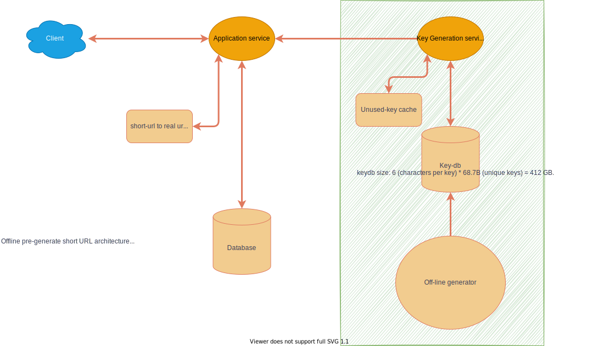

# DESIGN A URL SHORTENER

## Design scope

- Write operation: 100 million URLs are generated per day.
- Write operation per second: 100 million / 24 /3600 = 1160
- Read operation: Assuming ratio of read operation to write operation is 10:1, read operation per second: 1160 * 10 = 11,600
- Assuming the URL shortener service will run for 10 years, this means we must support 100 million * 365 * 10 = 365 billion records.
- Assume average URL length is 100.
- Storage requirement over 10 years: 365 billion * 100 bytes * 10 years = 365 TB

## Ideas

### Hash function

- Hash value length
- Hash + collision (If length is too long)

### Base conversion

- Depends on a unique ID generator
- There is a security concern

## Offline-archite

